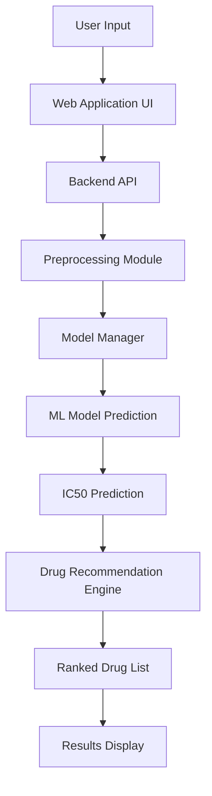
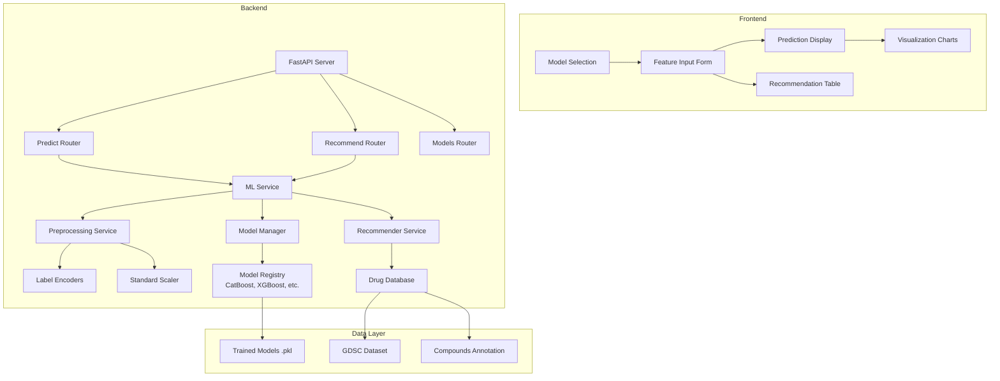
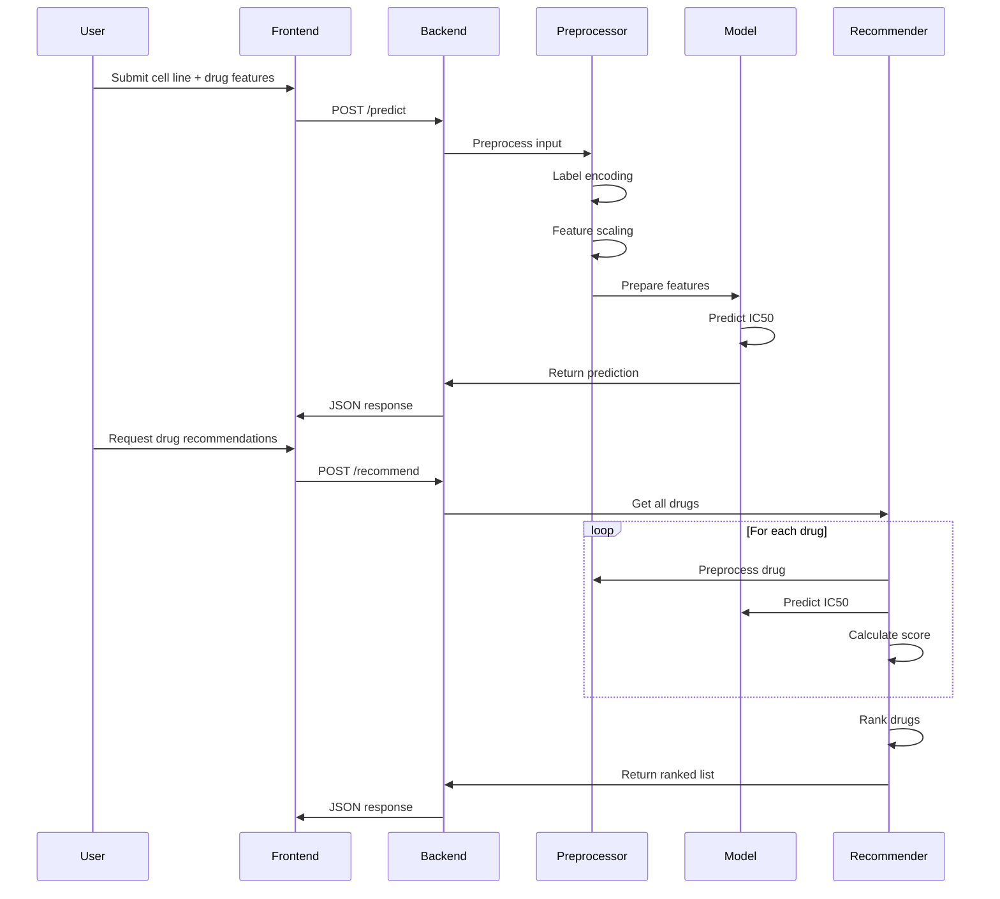
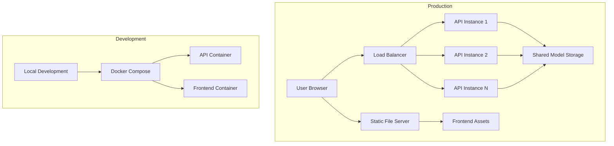

# System Architecture

## Overall System Flow

## Component Architecture

## ML Pipeline Sequence

## Data Flow

```mermaid
flowchart LR
    A[Raw Input Features] --> B[Data Validation]
    B --> C[Missing Value Handling]
    C --> D[Categorical Encoding]
    D --> E[Feature Scaling]
    E --> F[Feature Selection<br/>9 features]
    F --> G[Model Prediction]
    G --> H[IC50 Output]
    H --> I[Score Calculation]
    I --> J[Ranking Algorithm]
    J --> K[Final Recommendations]
```

## Deployment Architecture

## Key Components Description

### 1. Preprocessing Module
- **Input**: Raw feature values (categorical + numeric)
- **Processing**: 
  - Label encoding for 10 categorical features
  - Standard scaling for all 9 features
  - Feature selection to match training set
- **Output**: Processed features ready for model prediction

### 2. Model Manager
- **Discovery**: Auto-detects `.pkl` files in `/model/`
- **Loading**: Lazy loading of models on first use
- **Caching**: Keeps loaded models in memory
- **Interface**: Uniform prediction interface across all models

### 3. Recommendation Engine
- **Drug Database**: All available drugs from Compounds-annotation.csv
- **Scoring**: `score = 1 / (1 + IC50)`
- **Ranking**: Sort by score (descending)
- **Filtering**: Optional by target pathway, drug class

### 4. API Layer
- **FastAPI**: Modern, fast web framework
- **Validation**: Pydantic models for request/response
- **Documentation**: Auto-generated OpenAPI/Swagger UI
- **Error Handling**: Comprehensive error responses

### 5. Frontend Application
- **Responsive Design**: Works on desktop and mobile
- **Dynamic Forms**: Adapts to selected model features
- **Visualization**: Charts for scores and rankings
- **User Experience**: Intuitive workflow for researchers

## Technology Stack

| Component | Technology | Purpose |
|-----------|------------|---------|
| Backend | FastAPI (Python) | REST API server |
| ML Framework | Scikit-learn, XGBoost, etc. | Model inference |
| Frontend | React/JavaScript | User interface |
| Data Processing | Pandas, NumPy | Feature engineering |
| Model Serialization | Joblib | .pkl file loading |
| Containerization | Docker | Deployment |
| Testing | Pytest | Quality assurance |

## Next Steps
1. Review and approve architecture
2. Begin implementation with Phase 2 (ML Engine)
3. Validate each component against notebook results
4. Iterate through remaining phases